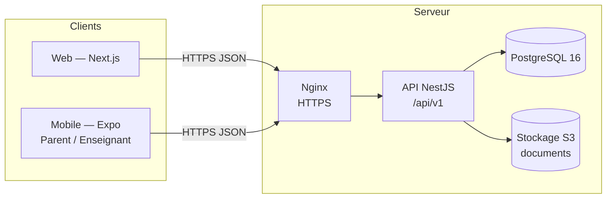

# Architecture — CSPAD DJOUGOU

> Référence : prompt maître V3.0, §3, §4, §8 et §33. Le document V2.9 (SRC-03), référence
> d'architecture, n'a pas été fourni : cette architecture sera confrontée à V2.9 dès sa
> réception (B3).

## Vue d'ensemble

- **Monorepo** pnpm + Turborepo, avec **un monolithe modulaire** côté serveur : une seule API,
  découpée en modules NestJS isolés, un par composante métier.
- **REST** sous `/api/v1`, en JSON UTF-8, dates ISO 8601 et identifiants UUID (§37).
- **Une seule frontière de sécurité : l'API.** Le Web et le Mobile ne font qu'adapter
  l'affichage aux droits de l'utilisateur. Chaque autorisation est vérifiée côté serveur,
  dans le contrôleur (garde) et dans le service métier (§8, §10).

## Organisation du dépôt

| Chemin                    | Rôle                                                                                |
| ------------------------- | ----------------------------------------------------------------------------------- |
| `apps/api`                | API NestJS : contrôleurs minces, services métier, filtres, garde RBAC (Phase 2)     |
| `apps/web`                | Application Next.js (App Router)                                                    |
| `apps/mobile`             | Application Expo (Expo Router)                                                      |
| `packages/types`          | Types partagés : enveloppes API, codes d'erreur, scopes                             |
| `packages/validation`     | Schémas Zod partagés : validation identique dans l'API, le Web et le Mobile         |
| `packages/business-rules` | Règles métier pures et testées (vide en Phase 1)                                    |
| `packages/config`         | Lecture et validation typée des variables d'environnement                           |
| `packages/utils`          | Décimaux exacts, dates métier                                                       |
| `packages/ui`             | Jetons de design Web et Mobile                                                      |
| `database/prisma`         | Schéma, migrations, seed, SQL (triggers) — Phase 2                                  |
| `docs/sources`            | Documents sources officiels, immuables et contrôlés par empreinte                   |
| `tests/`                  | Suites transverses : sécurité, E2E, performance, régression… (Phase 2 et suivantes) |
| `docker/`                 | Environnement de développement (PostgreSQL, stockage S3 local)                      |

Graphe de dépendances : les `apps/*` dépendent des `packages/*`, jamais l'inverse.
`business-rules` ne dépend d'aucune couche d'I/O.

## Modules de l'API (cible)

| Module NestJS                           | Composante                 | Phase |
| --------------------------------------- | -------------------------- | ----- |
| `health`                                | Système                    | 1 ✅  |
| `auth`, `iam`, `audit`                  | Sécurité                   | 2     |
| `administration`                        | 1 — Administration         | 3     |
| `students`, `admissions`, `enrollments` | 2 — Élèves et inscriptions | 3     |
| `pedagogy`                              | 3 — Pédagogie              | 4     |
| `finance`                               | 4 — Finance                | 5     |
| `hr`, `payroll`                         | 5 — Personnel et paie      | 6     |
| `communication`                         | 6 — Communication          | 7     |

## Chaîne de traitement d'une requête (socle actuel)

1. `helmet` : en-têtes de sécurité.
2. Politique CORS : fermée par défaut, liste blanche configurable.
3. Lecture du corps JSON, limitée en taille (`API_BODY_LIMIT`).
4. `RequestIdMiddleware` : attribue un `X-Request-Id`.
5. Contrôleur, avec validation Zod via `ZodValidationPipe`.
6. `ApiExceptionFilter` : format d'erreur unique, sans fuite d'information interne.

Les étapes suivantes seront ajoutées en Phase 2 : authentification JWT, garde RBAC et scope,
idempotence, audit.

## Journalisation

- **Journal technique** : logger NestJS, avec erreurs 5xx et `requestId`.
- **Audit métier** : table `audit_logs` en ajout seul (Phase 2).

Les deux ne sont jamais mélangés (§56).
