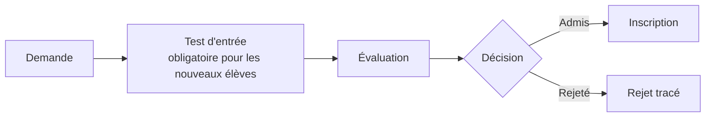

# Flux principaux

Flux tels que décrits par le prompt maître V3.0. Ils seront **confrontés à la spécification
V2.0 (SRC-01)** dès sa réception. Les points marqués ⚠ sont ouverts
(voir le §5 de [`docs/phase-0/RAPPORT_PHASE_0.md`](../phase-0/RAPPORT_PHASE_0.md)).

## 1. Admission (§15)

La prématernelle permet d'enregistrer une demande avant l'inscription (âge de référence : 3 ans).
⚠ A10 : date de référence pour le calcul de l'âge.

## 2. Inscription (§16) — une seule transaction

1. Autorisation.
2. Vérification de l'année scolaire.
3. Vérification de l'admission.
4. Détection des conflits (pas de double inscription dans la même classe et la même année).
5. Création de l'inscription.
6. Affectation à une classe.
7. Génération des frais.
8. Application des remises admissibles (⚠ A4, A5, A6).
9. Audit.
10. Événements (outbox).

⚠ A8 : effet sur l'inscription d'une tranche 1 non payée.

## 3. Paiement (§18, §19, §34) — une seule transaction, idempotente

1. Autorisation (permission finance).
2. Validation.
3. Création du paiement.
4. Affectation aux charges.
5. Recalcul **serveur** des soldes et statuts.
6. Reçu avec numéro unique (séquence verrouillée, ⚠ A23).
7. Mouvement de caisse.
8. Écritures comptables (⚠ A22).
9. Audit.
10. Événements (outbox).

Correction uniquement par annulation ou contrepassation. **Aucune suppression physique.**

## 4. Notes → bulletin (§22 à §29)

Passage au collège : moyenne annuelle ≥ 10 → passage ; < 10 → redoublement (⚠ A11). Coefficients
issus exclusivement de SRC-04 et SRC-05 (⚠ B4).

## 5. Paie (§31, §32)

⚠ Paramètres fiscaux et sociaux (CNSS, ITS, AIB, VPS/PVS…) : **aucun paramètre validé** (B5, A18). Le calcul sera **refusé** tant qu'une règle
applicable n'a pas été saisie et validée pour la période. Aucune valeur par défaut, aucun taux codé en dur.
